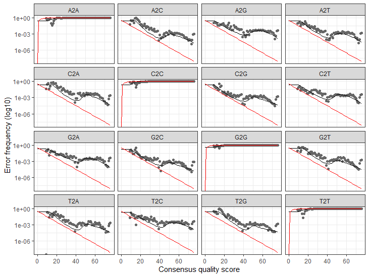

# pipeline_using_obitools_and_dada2

**Bastien Macé, 2020**

_________________________________


# Table of contents

  * [Introduction](#introduction)
  * [Installation](#installation)
    + [Preliminary steps for OBITools](#preliminary-steps-for-obitools)
    + [Preliminary steps for dada2](#preliminary-steps-for-dada2)
  * [STEP 1 : Pair-end sequencing (OBITools)](#step1)
  * [STEP 2 : Demultiplexing (OBITools)](#step2)
  * [STEP 3 : Be prepared (dada2)](#step3)
  * [STEP 4 : Inspect the quality profiles of the reads (dada2)](#step4)
  * [STEP 5 : Filtering & Trimming (dada2)](#step5)
  * [STEP 6 : Dereplication (dada2)](#step6)
  * [Step 7 : Error rates learning (dada2)](#step7)
  * [Step 8 : Observing the ASVs returned (dada2)](#step8)
  * [Step 9 (Optionnal) : Removing chimeras (dada2)](#step9)
  * [Step 10 : Summary of the filtering](#step10)
_________________________________

## Introduction 

This project has for goal to filtrate efficiently eDNA sequences after PCR amplification and NGS, in order to eliminate the false sequences generated by these 2 technologies.

For that, we will use the OBITools commands and dada2.

- [OBITools](https://git.metabarcoding.org/obitools/obitools/wikis/home) are commands written in python
- [dada2](https://benjjneb.github.io/dada2/tutorial.html) is a pipeline based on R language

In this example, 2 datasets are used, because the study analyzes the sequencing of 2 tiles.

## Installation

### Preliminary steps for OBITools

- First you need to have Anaconda installed

If it's not the case, click on this [link](https://www.anaconda.com/products/individual/get-started) and download it.

Install the download in your shell :
```
bash Anaconda3-2020.07-Linux-x86_64.sh
```

Then, close your shell and reopen it.
Verify conda is correctly installed. It should be here :
```
/~/anaconda3/bin/conda
```

Reopen your shell and write the following line :
```
conda config --set auto_activate_base false
```

- Create your new environment obitools from your root in your corresponding path. For example :
```
ENVYAML=./dada2_and_obitools/obitools_env_conda.yaml
conda env create -f $ENVYAML
```

Now you can activate your environment :
```
conda activate obitools
```
And deactivate it :
```
conda deactivate
```


### Preliminary steps for dada2

- First you need to have a recent R version (3.6.2 minimum)

If it's not the case, click on this [link](hhttps://cran.r-project.org/) and download it.

- Then, open your IDE (RStudio for example), and install the package dada2 :
```
install.packages("dada2")
```

If you have troubles to install the package, follow the instructions [here](https://benjjneb.github.io/dada2/dada-installation.html).

<a name="step1"></a>
## STEP 1 : Pair-end sequencing (OBITools)

First, unzip your data in your shell if you need :
```
unzip mullus_surmuletus_data.zip
```

Activate your environment in your shell :
```
conda activate obitools
```

Use the function illuminapairedend to make the pair-end sequencing from the forward and reverse sequences you have in your data :
```
illuminapairedend --score-min=40 -r mullus_surmuletus_data/200221_SN234_A_L001_AIMI-199_R1.fastq mullus_surmuletus_data/200221_SN234_A_L001_AIMI-199_R2.fastq > AIMI-199.fastq
illuminapairedend --score-min=40 -r mullus_surmuletus_data/200221_SN234_A_L001_AIMI-200_R1.fastq mullus_surmuletus_data/200221_SN234_A_L001_AIMI-200_R2.fastq > AIMI-200.fastq
# a new .fastq file is created, it contains the sequences after the pair-end of forward and reverse sequences which have a quality score higher than 40 (-- score-min=40)
```

To only conserve the sequences which have been aligned, use obigrep :
```
obigrep -p 'mode!="joined"' AIMI-199.fastq > AIMI-199.ali.fastq
obigrep -p 'mode!="joined"' AIMI-200.fastq > AIMI-200.ali.fastq
# -p requires a python expression
# the unaligned sequences are notified with mode="joined" whereas the aligned sequences are notified with mode="aligned"
# so here python creates new datasets (.ali.fastq) which only contain the sequences notified "aligned"
```

<a name="step2"></a>
## STEP 2 : Demultiplexing (OBITools)

The .txt files assign each sequence to its sample thanks to its tag because each tag corresponds to a reverse or a forward sequence from a sample.

To be able to compare the sequences next, you need to remove these tags, and to use the function ngsfilter :
```
ngsfilter -t mullus_surmuletus_data/AIMI_199_corr_tags.txt -u AIMI-199.unidentified.fastq AIMI-199.ali.fastq > AIMI-199.ali.assigned.fastq
ngsfilter -t mullus_surmuletus_data/AIMI_200_corr_tags.txt -u AIMI-200.unidentified.fastq AIMI-200.ali.fastq > AIMI-200.ali.assigned.fastq
# the function creates new files :
# .unidentified.fastq files contain the sequences that were not assigned whith a correct tag
# .ali.assigned. fastq files contain the sequences that were assigned with a correct tag, so it contains only the barcode sequences
```

Then, separate your .ali.assigned.fastq files depending on their samples in placing them in a dedicated folder (useful for next steps) :
```
mkdir samples
# create the folder
mv -t samples AIMI-199.ali.assigned.fastq AIMI-200.ali.assigned.fastq
# place the latests .fastq files in the folder
cd samples
obisplit -t samples --fastq experiment/AIMI-199.ali.assigned.fastq
obisplit -t samples --fastq experiment/AIMI-200.ali.assigned.fastq
# separation of the files depending on their samples
mv -t ./dada2_and_obitools AIMI-199.ali.assigned.fastq AIMI-200.ali.assigned.fastq
# removing the original files from the folder
```

Now you have as many files as samples, containing pair-ended and demultiplexed sequences.

<a name="step3"></a>
## STEP 3 : Be prepared (dada2)

Now that your data have been paired-end and demultiplexed, they have the correct format for dada2.

Quit your shell and open your IDE for R.

First you have to load the dada2 package :
```
library("dada2")
```

Write your path as a shortcut to make it easier to treat your data next :
```
path1 <- "./dada2_and_obitools/samples"
```

You can verify your data will be correctly treated with this path:
```
list.files(path1)
```

Then select the files you want to analyze in your path :
```
fns <- sort(list.files(path1, pattern = ".fastq"", full.names = T))
# sort is a function that can be used to extract some files, from the list of the path files here
# the function will only extract files that end with the pattern chosen
# they will be extracted with their full names, that is to say with their complete path
```

And select the part of the files name you want to keep :
```
sample.names <- sapply(strsplit(basename(fns), ".fastq"), '[', 1)
# sapply permits to apply a function to a vector, returning a vector
# here, the function is applied to the only vector fns
# the function base name removes all the path up to the file name
# the function strsplit removes the pattern written
```

<a name="step4"></a>
## STEP 4 : Inspect the quality profiles of the reads (dada2)

The function plotQualityProfile will display a graphic representing the quality score for each nucleotides of the reads in the file :
```
plotQualityProfile(fns[10])
# the plot gives different information :
# the grey-scale represents the quality score frequency at each base position
# on the sequences : darker is the plot, higher is the frequency
# the lines show summary statistics : mean in green, median in orange, and
# first and third quartiles in dashed orange
# the red line indicates the percentage of reads that extend to at least the
# position corresponding to the abscissa on the horizontal axe
```

 

The analysis of the plots helps in the decision of the filter parameters to chose for the next step, thanks to the quality score, which learn us the sequencing precision :

 Q score | Precision
---------|-----------|
10 | 90%
20 | 99%
30 | 99,9%
40 | 99,99%

Here, we can see that the average quality score of the 250 first bases is superior than 40, and an important part of the reads have a length at least equal to 250 bases.

<a name="step5"></a>
## STEP 5 : Filtering & Trimming (dada2)

Initiate the creation of a new folder to store the filtered sequences generated :
```
filts1 <- file.path(path1, "filtered", paste0(sample.names, ".filt.fastq.gz"))
# file.path builds the path to the new folder, which will be located in the
# path already used and which name will be "filtered"
# the files will be named as described before with sample.names, and the pattern
# ".filt.fastq.gz" will be added
```

These files are created after trimming and filtering with different criteria :
```
out <- filterAndTrim(fns, filts1,
                     truncLen = 234,
                     maxN = 0,
                     maxEE = 1,
                     compress = T,
                     verbose = T)
# truncLen value is chosen considering the marker length and define were the
# reads will be trimmed
# reads which are shorten than this value are filtered
# maxN is the number of N tolerated in the sequences after filtering
# maxEE define the maximal number of expected errors tolerated in a read, based
# on the quality score (EE = sum(10^(-Q/10)))
# compress = T means that the files will be gzipped
# verbose = T means that information concerning the number of sequences after
# filtering will be given
```

You need to create a new path to these files, because some files of filts1 may have been completely filtered, and the next functions won't work :
```
path2 <- "./dada2_and_obitools/samples/filtered"
filts2 <- sort(list.files(path2, pattern = ".fastq", full.names = T))
```

<a name="step6"></a>
## STEP 6 : Dereplication (dada2)

After all these steps, you can eliminate all the amplicons of each sequence from the new .fastq.gz files :
```
derep <- derepFastq(filts)
# the function annotates each sequence with his abundance
```

<a name="step7"></a>
## Step 7 : Error rates learning (dada2)

The learnErrors function is able to distinguish the incorrect sequences from the correct sequences, by estimating the sequencing error rate.

To build the error model, the function alternates estimation of the error rate and inference of sample composition until they converge on a jointly consistent solution.

The algorithm calculates the abundance p-value for each sequence. This p-value is defined by a Poisson distribution, with a parameter correspondig to the rate of amplicons of a sequence i generated from a sequence j. The smallest this p-value is, the more reads of sequence i can be explained by errors from sequence j.

Before that, a partition is built with the most abundant sequence as the core. All the other sequences are compared to this core. The sequence with the smallest p-value is analyzed : if this p-value is inferior than a parameter of the algorithm (OMEGA_A), this sequence become the core of a new partition. The other sequences joins the partition most likely to have produced the core. This operation is repeated until there is no p-value which falls under the parameter OMEGA_A.

Then, all the sequences from a partition are transformed into their core, so each partition corresponds to a unique sequence : the ASV.
```
err1 <- learnErrors(derep, randomize = T, errorEstimationFunction = loessErrfun)
err2 <- learnErrors(derep, randomize = T, errorEstimationFunction = noqualErrfun)
# errorEstimationFunction can take the value "loessErrfun" if you want to use
# the quality score of your sequence to build the model, or "noqualErrfun" if
# you don't want it
```

You can plot the estimated error rates :
```
plotErrors(err1, nominalQ = T)
plotErrors(err2, nominalQ = T)
# the error rates of each possible base transition are displayed
# black dots are the observed error rates for each consensus quality score
# the black line follows these dots, showing the estimated error rates after
# convergence of the algorithm
# the red line represents the error rates expected with the definition of
# quality score
```

With errorEstimationFunction = loessErrfun :



With errorEstimationFunction = noqualErrfun :


Then, eliminate the false sequences identified by the algorithm to conserve only the ASVs :
```
dadas1 <- dada(derep, err1)
dadas2 <- dada(derep, err2)
```

<a name="step8"></a>
## Step 8 : Observing the ASVs returned (dada2)

Construct a sequence table with your sequences filtered :
```
seqtab_avec_chimeres1 <- makeSequenceTable(dadas1)
seqtab_avec_chimeres2 <- makeSequenceTable(dadas2)
```

Create a .csv file containing this table :
```
write.csv(seqtab_avec_chimeres1, "./dada2_and_obitools/ASVs_avec_chimeres_loessErrfun.csv")
write.csv(seqtab_avec_chimeres2, "./dada2_and_obitools/ASVs_avec_chimeres_noqualErrfun.csv")
```

Create a new .fasta file containing the ASVs :
```
uniqueSeqs1 <- getUniques(seqtab_avec_chimeres1)
uniqueSeqs2 <- getUniques(seqtab_avec_chimeres2)
# extract the vectors from the table
uniquesToFasta(uniqueSeqs1, "./dada2_and_obitools/ASVs_avec_chimeres_loessErrfun.fasta")
uniquesToFasta(uniqueSeqs2, "./dada2_and_obitools/ASVs_avec_chimeres_noqualErrfun.fasta")
# create the fasta file with these vectors
```

<a name="step9"></a>
## Step 9 (Optionnal) : Removing chimeras (dada2)

You can remove the sequences considered as chimeras in the table by directly creating a new table and .csv file then, and repeating the same functions for create a new fasta file :
```
seqtab_sans_chimeres1 <- removeBimeraDenovo(seqtab_avec_chimeres1, verbose = T)
seqtab_sans_chimeres2 <- removeBimeraDenovo(seqtab_avec_chimeres2, verbose = T)
# the function only extracts bimeras in reality
write.csv(seqtab_sans_chimeres1, "./dada2_and_obitools/ASVs_sans_chimeres_loessErrfun.csv")
write.csv(seqtab_sans_chimeres2, "./dada2_and_obitools/ASVs_sans_chimeres_noqualErrfun.csv")
uniqueSeqs1 <- getUniques(seqtab_sans_chimeres1)
uniqueSeqs2 <- getUniques(seqtab_sans_chimeres2)
uniquesToFasta(uniqueSeqs1, "./dada2_and_obitools/ASVs_sans_chimeres_loessErrfun.fasta")
uniquesToFasta(uniqueSeqs2, "./dada2_and_obitools/ASVs_sans_chimeres_noqualErrfun.fasta")
```

<a name="step10"></a>
## Step 10 : Summary of the filtering

Now we can build the recapitulative tables of the pipeline filters :
```
getN <- function(x) sum(getUniques(x))
track1 <- cbind(out, sapply(dadas1, getN), rowSums(seqtab_sans_chimeres1))
colnames(track1) <- c("input", "filtered", "denoised", "nonchim")
rownames(track1) <- sample.names
track1
track2 <- cbind(out, sapply(dadas2, getN), rowSums(seqtab_sans_chimeres2))
colnames(track2) <- c("input", "filtered", "denoised", "nonchim")
rownames(track2) <- sample.names
track2
```

Now you can make a statistical analysis to evaluate your filtering quality.