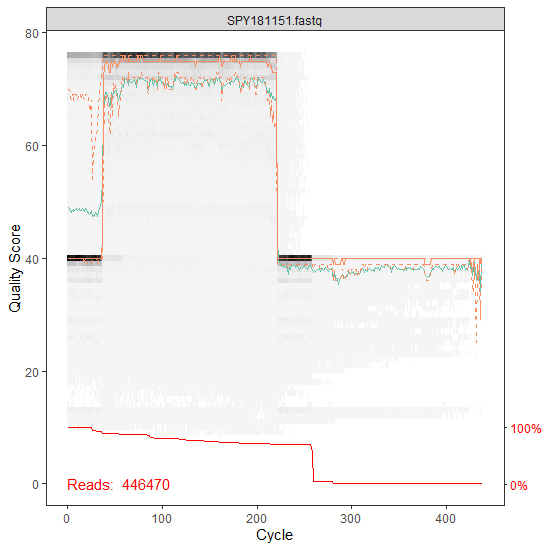

# pipeline_using_obitools_and_dada2

**Bastien Macé, Clémence Raphael, 2020-2021**

_________________________________


# Table of contents

  * [Introduction](#introduction)
  * [Installation](#installation)
    + [Preliminary steps for OBITools](#preliminary-steps-for-obitools)
    + [Preliminary steps for dada2](#preliminary-steps-for-dada2)
  * [STEP 1 : Pair-ended merging (OBITools)](#step1)
  * [STEP 2 : Demultiplexing (OBITools)](#step2)
  * [STEP 3 : Be prepared (dada2)](#step3)
  * [STEP 4 : Inspect the quality profiles of the reads (dada2)](#step4)
  * [STEP 5 : Filtering & Trimming (dada2)](#step5)
  * [STEP 6 : Dereplication (dada2)](#step6)
  * [STEP 7 : Error rates learning (dada2)](#step7)
  * [STEP 8 : Generate your final files (dada2)](#step8)
  * [STEP 9 (Optionnal) : Bimeras removal (dada2)](#step9)
  * [STEP 10 : Analyse your results](#step10)
_________________________________

## Introduction 

This project has for goal to filtrate efficiently eDNA sequences after PCR amplification and NGS, in order to eliminate the false sequences generated by these technologies.

For that, we will use the OBITools commands and dada2.

- [OBITools](https://git.metabarcoding.org/obitools/obitools/wikis/home) are commands written in python
- [dada2](https://benjjneb.github.io/dada2/tutorial.html) is a pipeline based on R language

In this example, 2 datasets are used, because the study analyzes the sequencing of 2 tiles.

## Installation

### Preliminary steps for OBITools

- First you need to have Anaconda installed

If it's not the case, click on this [link](https://www.anaconda.com/products/individual/get-started) and download it.

Install the download in your shell :
```
bash Anaconda3-2020.07-Linux-x86_64.sh
```

Then, close your shell and reopen it.
Verify conda is correctly installed. It should be here :
```
~/anaconda3/bin/conda
```

Write the following line :
```
conda config --set auto_activate_base false
```

- Create your new environment obitools from your root in your corresponding path. For example :
```
ENVYAML=./dada2_and_obitools/obitools_env_conda.yaml
conda env create -f $ENVYAML
```

Now you can activate your environment :
```
conda activate obitools
```
And deactivate it :
```
conda deactivate
```


### Preliminary steps for dada2

- First you need to have a recent R version (3.6.2 minimum)

If it's not the case, click on this [link](hhttps://cran.r-project.org/) and download it.

- Then, open your IDE (RStudio for example), and install the package dada2 :
```
install.packages("dada2")
```

If you have troubles to install the package, follow the instructions [here](https://benjjneb.github.io/dada2/dada-installation.html).

<a name="step1"></a>
## STEP 1 : Pair-ended merging

First, unzip your data in your shell if you need :
```
unzip mullus_surmuletus_data.zip
```

Activate your environment in your shell :
```
conda activate obitools
```

Use the command _illuminapairedend_ to make the pair-ended merging from the forward and reverse strands of the sequences you have in your data. The command aligns the complementary strands in order to get a longer sequence. In fact, after PCR, the last bases are rarely correctly sequenced. So having the forward and the reverse strands allows to lenghten the sequence, thanks to the beginning of the reverse strand, which is usually correctly sequenced.
```
illuminapairedend --score-min=40 -r mullus_surmuletus_data/Aquarium_2_R1.fastq mullus_surmuletus_data/Aquarium_2_R2.fastq > Aquarium_2.fastq
# a new .fastq file is created, it contains the sequences after the merging of forward and reverse strands
# alignments which have a quality score higher than 40 (-- score-min=40) are merged and annotated "aligned", while alignemnts with a lower quality score are concatenated and annotated "joined"
```

To only conserve the sequences which have been merged, use _obigrep_ :
```
obigrep -p 'mode!="joined"' Aquarium_2.fastq > Aquarium_2.ali.fastq
# -p requires a python expression
# python creates a new dataset (.ali.fastq) which only contains the sequences annotated "aligned"
```

<a name="step2"></a>
## STEP 2 : Demultiplexing

A _.txt_ file assigns each sequence to its sample thanks to its tag, because each tag corresponds to a reverse or a forward sequence from a sample.

To compare the sequences next, you need to remove the tags and the primers, by using the _ngsfilter_ command :
```
ngsfilter -t mullus_surmuletus_data/Med_corr_tags.txt -u Aquarium_2.unidentified.fastq Aquarium_2.ali.fastq > Aquarium_2.ali.assigned.fastq
# the command creates new files :
# ".unidentified.fastq" file contains the sequences that were not assigned whith a correct tag
# ".ali.assigned.fastq" file contains the sequences that were assigned with a correct tag, so they contain only the barcode sequences
```

Then, separate your _.ali.assigned.fastq_ files depending on their samples in placing them in a dedicated folder (useful for next steps) :
```
mkdir samples
# create the folder
mv -t samples Aquarium_2.ali.assigned.fastq
# place the latests ".fastq" files in the folder
cd samples
obisplit -t samples --fastq sample/Aquarium_2.ali.assigned.fastq
# separate the files depending on their samples
mv -t ./dada2_and_obitools Aquarium_2.ali.assigned.fastq
# remove the original files from the folder
```

Now you have as many files as samples, containing merged pair-ended and demultiplexed sequences.

<a name="step3"></a>
## STEP 3 : Be prepared (dada2)

Now that your data have been paired-ended merged and demultiplexed, they have the correct format for dada2.

Quit your shell and open your IDE for R.

First you have to load the dada2 package :
```
library("dada2")
```

Write your path as a shortcut to make it easier to treat your data next :
```
path <- "./dada2_and_obitools/samples"
```

Then select the files you want to analyze in your path :
```
fns <- sort(list.files(path, pattern = ".fastq"", full.names = T))
# "sort" is a function that can be used to extract some files, from the list of the path files here
# the function only extracts files that end with the chosen pattern
# they are extracted with their whole path
```

And select the part of the files name you want to keep :
```
sample.names <- sapply(strsplit(basename(fns), ".fastq"), '[', 1)
# "sapply" permits to apply a function to a vector, returning a vector
# here, the function is applied to the only vector "fns"
# the function "basename" removes all the path up to the file name
# the function "strsplit" removes the pattern written
```

<a name="step4"></a>
## STEP 4 : Inspect the quality profiles of the reads (dada2)

The function _plotQualityProfile_ will display a graphic representing the quality score for each nucleotides of the reads in the file :
```
plotQualityProfile(fns[10])
# the plot gives different information :
# the grey-scale represents the quality score frequency at each base position on the sequences : darker is the plot, higher is the frequency
# the lines show summary statistics : mean in green, median in orange, and first and third quartiles in dashed orange
# the red line indicates the percentage of reads that extend to at least the position corresponding to the abscissa on the horizontal axe
```

Here is an example :

 

The analysis of the plots helps in the decision of the filter parameters to chose for the next step, thanks to the quality score, which learn us the sequencing precision :

 Q score | Precision
---------|-----------|
10 | 90%
20 | 99%
30 | 99,9%
40 | 99,99%

Here, we can see that the average quality score of the 250 first bases is superior than 40, and an important part of the reads have a length at least equal to 250 bases.

<a name="step5"></a>
## STEP 5 : Filtering & Trimming (dada2)

Initiate the creation of a new folder to store the filtered sequences generated :
```
filts <- file.path(path, "filtered", paste0(sample.names, ".filt.fastq.gz"))
# "file.path" builds the path to the new folder, which will be located in the path already used and which name will be "filtered"
# the files are named as described before with sample.names, and the pattern ".filt.fastq.gz" will be added
```

These files are created after trimming and filtering with different criteria :
```
out <- filterAndTrim(fns, filts,
                     truncLen = 235,
                     maxN = 0,
                     maxEE = 1,
                     compress = T,
                     verbose = T)
# "truncLen" value is chosen considering the marker length and define were the reads will be trimmed
# reads which are shorten than this value are filtered
# "maxN" is the number of N tolerated in the sequences after filtering
# "maxEE" define the maximal number of expected errors tolerated in a read, based on the quality score (EE = sum(10^(-Q/10)))
# "compress = T" means that the files will be gzipped
# "verbose = T" means that information concerning the number of sequences after filtering will be given
```

<a name="step6"></a>
## STEP 6 : Dereplication (dada2)

After all these steps, you can eliminate all the replications of each sequence from the new _.fastq.gz_ files :
```
derep <- derepFastq(filts)
# the function annotates each sequence with his abundance
```

<a name="step7"></a>
## STEP 7 : Error rates learning (dada2)

The _learnErrors_ function is able to distinguish the incorrect sequences from the correct sequences, by estimating the sequencing error rate.

To build the error model, the function alternates estimation of the error rate and inference of sample composition until they converge on a jointly consistent solution.

The algorithm calculates the abundance p-value for each sequence. This p-value is defined by a Poisson distribution, with a parameter correspondig to the rate of amplicons of a sequence i generated from a sequence j.

Before that, a partition is built with the most abundant sequence as the core. All the other sequences are compared to this core. The sequence with the smallest p-value is analyzed : if this p-value is inferior than a parameter of the algorithm (OMEGA_A), this sequence become the core of a new partition. The other sequences joins the partition most likely to have produced the core. This operation is repeated until there is no p-value which falls under the parameter *OMEGA_A*.

Then, all the sequences from a partition are transformed into their core, so each partition corresponds to a unique sequence : the ASV.
```
err <- learnErrors(derep, randomize = T)
```

You can plot the estimated error rates :
```
plotErrors(err, nominalQ = T)
# the error rates of each possible base transition are displayed
# black dots are the observed error rates for each consensus quality score
# the black line follows these dots, showing the estimated error rates after convergence of the algorithm
# the red line represents the error rates expected with the definition of quality score
```

Here is an example :


Then, eliminate the false sequences identified by the algorithm to conserve only the ASVs :
```
dadas <- dada(derep, err)
```

<a name="step8"></a>
## STEP 8 : Generate your final files (dada2)

Construct a sequence table with your sequences filtered :
```
seqtab_with_bimeras <- makeSequenceTable(dadas)
```

Create a new .fasta file containing the ASVs :
```
uniqueSeqs <- getUniques(seqtab_with_bimeras)
# extract the vectors from the table
uniquesToFasta(uniqueSeqs, "./dada2_and_obitools/ASVs_with_bimeras.fasta")
# create the fasta file with these vectors
```

<a name="step9"></a>
## STEP 9 (Optionnal) : Bimeras removal (dada2)

You can remove the sequences considered as bimeras in the table by directly creating a new table, and repeating the same functions for create a new fasta file :
(Bimeras are two-parent chimeric sequences. Chimeric sequences, or PCR-mediated recombinant, are sequences built from a merging of different closely related DNA templates during PCR.)
```
seqtab_with_bimeras <- removeBimeraDenovo(seqtab_without_bimeras, verbose = T)
uniqueSeqs <- getUniques(seqtab_without_bimeras)
uniquesToFasta(uniqueSeqs1, "./dada2_and_obitools/ASVs_without_bimeras.fasta")
```

<a name="step10"></a>
## STEP 10 : Analyse your results
Now you can make a statistical analysis to evaluate your filtering quality, after comparing the ASVs returned by the pipeline with your reference dataset.